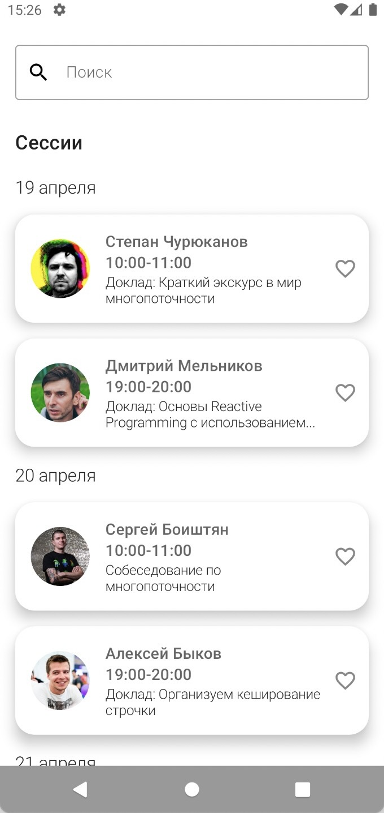
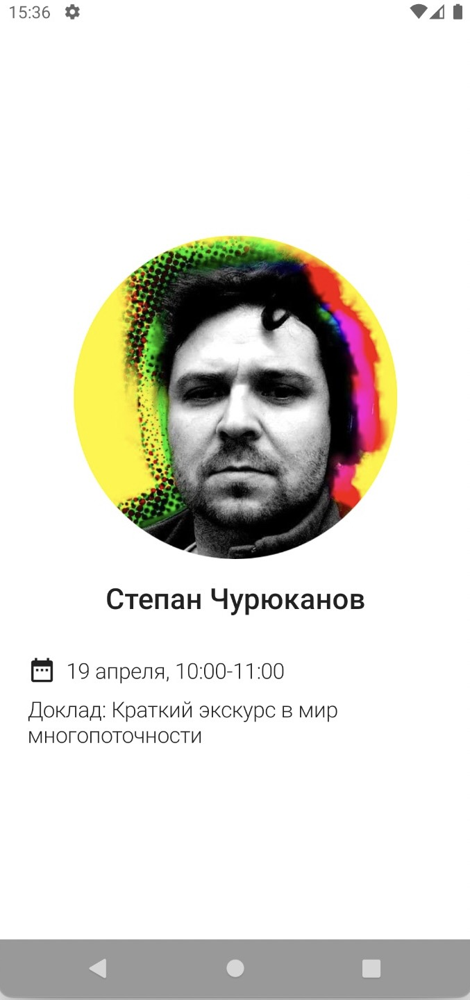
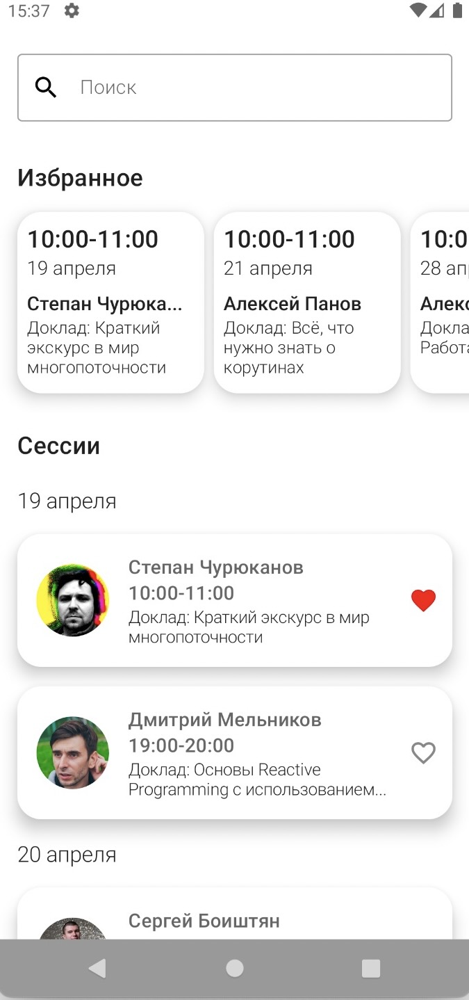
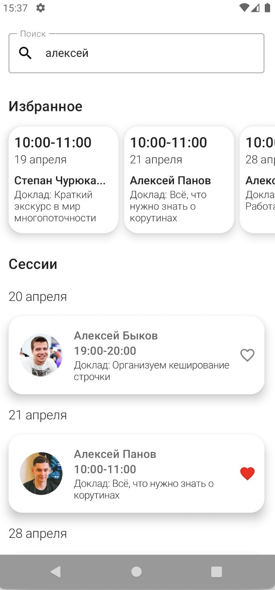
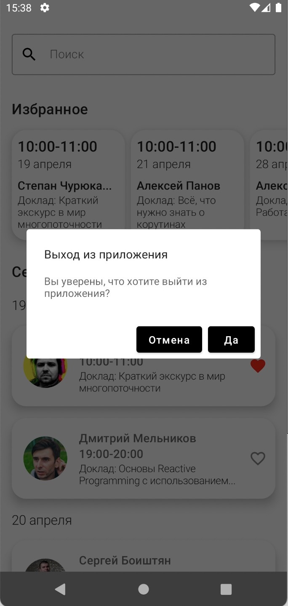
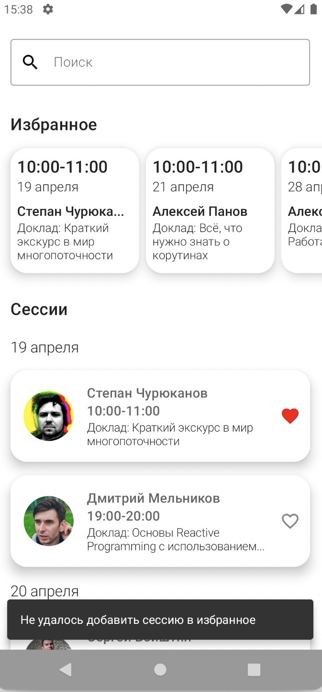

## PodlodkaAndroidCrew

Android приложение PodlodkaAndroidCrew - это приложение со списком сессий с конференции Podlodka Android Crew, с использованием Jetpack Compose

Приложение предусматривает следующий функционал:
* Группировка списка сессий по дате
* При нажатии на сессию, осущестляется переход на экран подробного просмотра сессии
* Сессию можно добавить в избранное, нажав на иконку "избранное", при этом она остается в текущем списке и добавляется в блок избранное. Повторное нажатие на эту иконку убирает сессию из избранного. Если в избранном нет ни одной сессии, то этот блок скрывается
* Максимум можно добавить только 3 сессии в избранное, иначе будет показан SnackBar с сообщением: "Не удалось добавить сессию в избранное"
* Избранные сессии переживают изменение конфигурации устройства, но могут очищаться при каждом перезапуске приложения
* Поддержка темной и светлой темы
* При нажатии на кнопку "назад" на экране списка сессий, будет показан диалог с сообщением: "Вы уверены, что хотите выйти из приложения?" и двумя кнопками: "да" и "отмена". При утвердительном ответе пользователя, осуществляется выход из приложения, иначе диалог закрывается
* Поиск по сессиям в приложении по имени докладчика

Приложение было реализовано по данному [заданию](https://docs.google.com/document/d/1XiNfo4pGc5VT1e-88bU7JB23IxE3QAmVOovgFT7FSwA/edit)

## Screenshots

